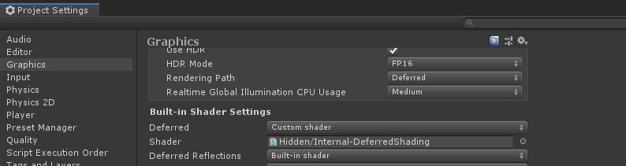

# Falloff Customizer
## Interactively adjust light falloff values for Unity deferred rendering

By default, Unity lights use a linear falloff model. In nearly every single instance, this won't compare to lighting in other game engines (or the HDRP). Especially if you're using linear color space and the deferred render path, you'll probably want this issue fixed as soon as possible! This package not only converts your lighting model to the more standard Inverse Square falloff model, but also allows you from then on to customize the falloff for lighting in your project.

### Usage

Navigate to the *Falloff Customizer* folder in the packages section of the project view and drag the prefab into any scene - delete once you're done!

- Adjust the curve to edit the falloff for your lights - this is pretty straightforward, but keep in mind that best results are achieved by having the curve time remain in the 0-1 range.
- You can adjust the falloff for the progressive lightmapper. Just switch between settings, disable then re-enable the script - results will change on your next bake.
- You can adjust the resolution of the falloff lookup texture that the package generates (the default editor resolution is 16); adjust to your liking - I find 8 better but 16 has a little more edge to it.

### Compatibility

The *UnityDeferredLibrary.cginc* and *Internal-DeferredShading.shader* included in this package are built for Unity 2019.1 - It *might* work with Unity Unity 2019.2, but in all likeliness you'll need to find the correct files for your version - they're widely available online, just Google *Unity Internal Shaders* with your version after that. 

Once you have the two new shader files inside your project, you'll need to override the default deferred shader with the one you imported in the *Graphics* settings. This done, open the *UnityDeferredLibrary.cginc* file and edit as such:

- Right after the *UNITY_DECLARE_DEPTH_TEXTURE(_CameraDepthTexture);* line, add *sampler2D _customFalloffTexture;*
- aside from it's first instance in the file, replace all instances of *_LightTextureB0* with *_customFalloffTexture*

Save and reimport, then it should work - otherwise just add an issue on this repo and I'll see what I can do.

### Install process

Unlike most of my other packages, this repo does not only contain a package but also a sample project. While you can install the package onto any other Unity project, you can open the correctly configured sample project to check things out first - if you're then happy follow the instructions below.

This is a plugin that makes use of Unity's new *Package Manager* feature. Just drop the *com.alexismorin.falloffcustomizer* folder into your *packages* folder (found at the same level as the Assets folder) and it should work out-of-the-box. If you're using an older version of Unity (not really supported here, but can be made to work if you're courageous), take the *com.alexismorin.falloffcustomizer* folder and then drag it anywhere into your regular project hierarchy.

### Acknowledgements

Standard pipeline Unity light still use range instead of attenuation, and will thus never be 100% physically accurate. This package can get you pretty close, but if all else fails I guess you can switch to Unreal Engine 😏

[TwoTailsGames for their Unity 2019.1 internal shader repo.](https://github.com/TwoTailsGames/Unity-Built-in-Shaders)

[The SCP: Containment Breach - Unity development team for being so friendly and laying out the initial issue](https://www.scp-unity.com/)

[Arthur Daurio for writing this excellent article on the backend behind the problem.](http://arthurdaurio.com/2018/05/13/inverse-square-falloff-in-unity/)

Per usual, whipped up in around an hour on my couch - bugs beware.
